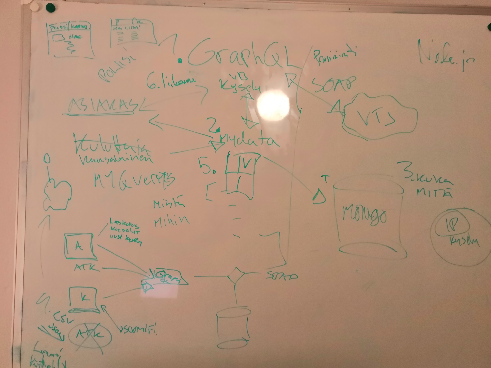

# VRK Syysmyräkkä Hack
This is the prototype of proposal for GraphQL application interfaces for VRK and other public services in Finland.

We believe that minimising the technical burden of public services is a driver for local markets and innovation.

# Installation
Install docker (find it from https://docs.docker.com/install/)

After docker installation, clone this repository.
To start all the three apps, run the following command

- Windows

    runWithDocker.bat
    
- Other

    sudo ./runWithDocker.sh (if will not launch, type chmod +x runWithDocker.sh and try again!)

# To test app
MyData view (uses a fixed user, http://localhost)
Example personal data query (http://localhost:3001/graphql)
```
query getPersonByNationalId($Henkilotunnus: String!, $Loppukayttaja: String!, $SoSoNimi: String!) {
    PersonByNationalID(Henkilotunnus: $Henkilotunnus, Loppukayttaja: $Loppukayttaja, SoSoNimi: $SoSoNimi) {
  		Asiakasinfo {
        InfoS,
        InfoR,
        InfoE
      },

      Henkilo {
        NykyinenSukunimi {
          Sukunimi
        },
      	NykyisetEtunimet {
          Etunimet
        }
    	}
    }
  }
```
Example variables
```
{
  "Henkilotunnus": "121278-112A",
  "Loppukayttaja": "Firstname Lastname",
  "SoSoNimi": "Company name"
}
```

```
{
  "Henkilotunnus": "310118-998M",
  "Loppukayttaja": "Firstname Lastname",
  "SoSoNimi": "Company name"
}
```
Querys made with 310118-998M are the one shown on mydata-react

# Original Concept



# Presentation

https://docs.google.com/presentation/d/1YQMjTjkfRJ9HslK6J4iUehk1mN2oSNrDxbWhtd7eycQ/
